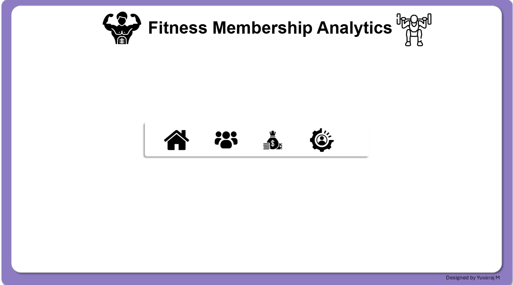
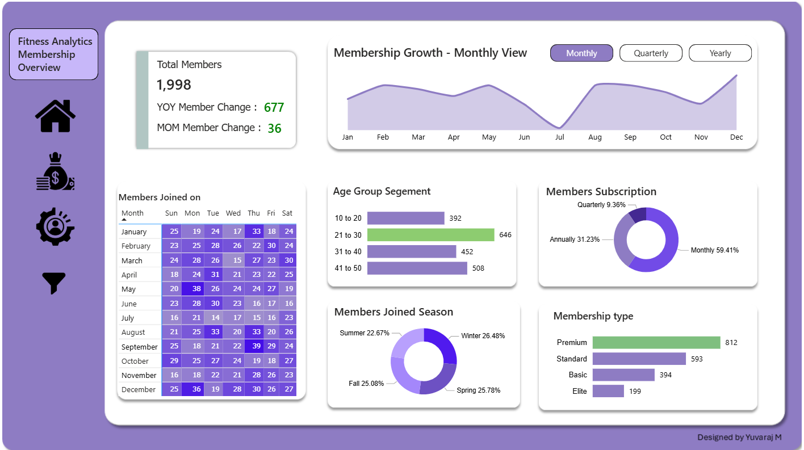
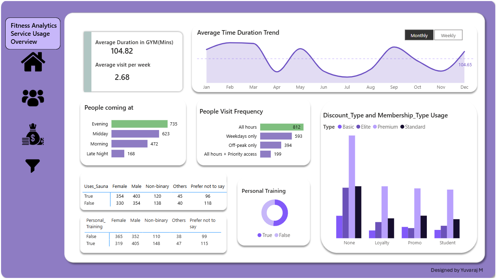

# OnyxDataChallengeAugust

# 🏋️‍♂️ 𝗙𝗶𝘁𝗻𝗲𝘀𝘀 𝗔𝗻𝗮𝗹𝘆𝘁𝗶𝗰𝘀 𝗗𝗮𝘀𝗵𝗯𝗼𝗮𝗿𝗱 – Onyx Data Challenge 

🎉 This is my submission for the Onyx Data Challenge, where I built an end-to-end Fitness Performance Dashboard using Power BI.

---

## 📊 Dashboard Highlights

## 📌 Project Overview
The **Fitness Analytics Dashboard** is built to analyze gym performance, member engagement, and revenue trends.  
It provides insights that help fitness centers **boost membership retention, optimize trainer utilization, and increase revenue**.

## 🚀 Features
- 📊 **Interactive Power BI Dashboard** – track member check-ins, revenue, and workout trends  
- ⚡ **Custom DAX Measures** – advanced calculations for time intelligence and KPIs  
- 🏃 **Fitness KPIs** – membership growth, churn analysis, trainer performance, and check-in frequency  
- 📈 **Actionable Insights** – data-driven recommendations for fitness business growth 
---

## 📊 Dashboard Preview

  

  

  

## 🛠 Tech Stack Used

| Tool / Language | Purpose |
|------------------|---------|
| 🧩 **Power BI** | Data modeling & interactive dashboards |
| 🧠 **DAX** | KPIs & calculated measures |
| 🧼 **Power Query** | Data transformation |
| 📉 **Visualization** | Data storytelling through visuals |

---
## 🧠 What I Learned

This challenge enhanced my skills in:
- 🔹 Data cleaning and transformation
- 🔹 DAX for custom calculations
- 🔹 Interactive dashboard design
- 🔹 Real-world healthcare data analysis

---

## 📸 Dashboard Preview

👉 **Live Power BI Report:**  
[Click here to view the interactive dashboard 🔗](https://app.powerbi.com/view?r=eyJrIjoiMDQ2NzJkZGQtMDU0ZS00MDI0LWJkMjktNDQ2ZmY3NTk0ZDM0IiwidCI6IjI1Y2UwMjYxLWJiZDYtNDljZC1hMWUyLTU0MjYwODg2ZDE1OSJ9)
> *(You can also add a screenshot or GIF preview here)*

---

## 📬 Let's Connect

- 💼 [LinkedIn – Yuvaraj M](https://www.linkedin.com/in/yuvarajmanalyst/)
- 📊 [View More Projects](https://github.com/Yuvaraj-DataAnalyst)

---

⭐ **If you found this project useful or inspiring, feel free to give it a star!**
